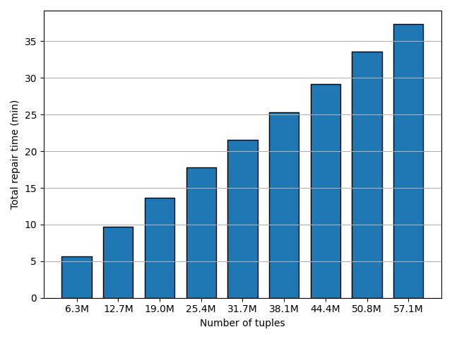
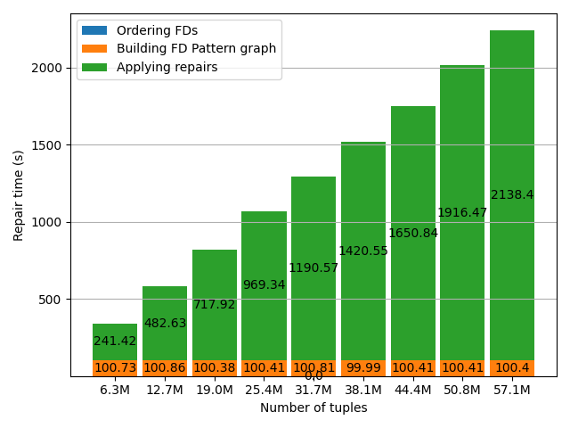

# Runtime linearity experiments

For our large dataset `service_tickets` (63M rows), we evaluated runtime performance only without analyzing repair effectiveness.

## Total repair time

The plot displays the total repair runtime in minutes for an increasing number of tuples. Each step on the x-axis has a size of n_tuples / 10.
Our experiment shows that Horizon scales linearly with an increasing amount of rows to repair. In addition, we show that our implementation can support large datasets that do not fit into memory.

## Repair time of each component

The second plot shows a more fine-grained view on Horizon's performance. Here, the repair time is shown in seconds and the runtime of each pipeline component is presented.
The first step of the pipeline, i.e., ordering FDs has a negligible effect on the repair time with less than one second. Furthermore, building the FD pattern graph takes around 100 seconds (around 1 1/2 minutes) for 63M tuples. In this experiment, we opted to build the FD pattern graph on the whole dataset. Applying the repairs has the highest runtime, due to iterating over all input tuples. It scales linearly.
